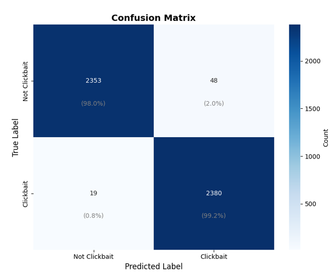
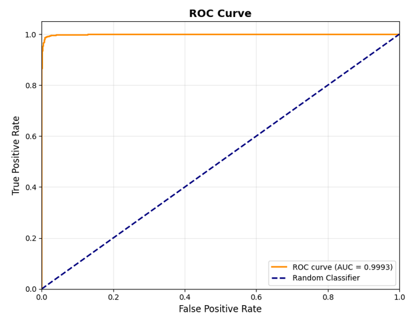
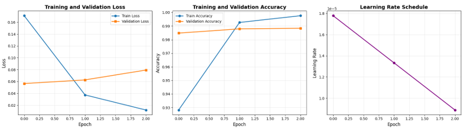
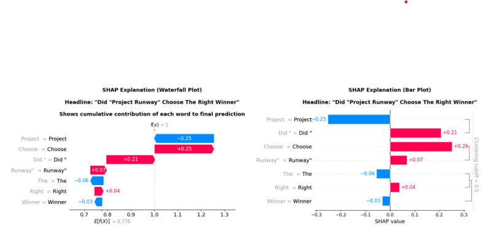
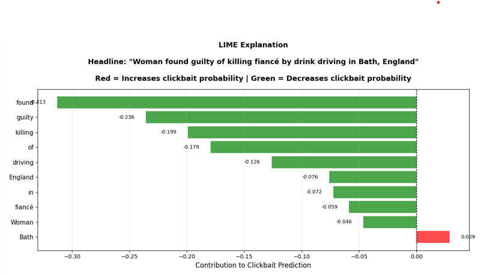

# Clickbait-detection-project using Deep Learning
Real-time clickbait detection using DistilBERT and XAI

## Overview
This project detects clickbait headlines using a hybrid model combining:
- DistilBERT
- Linguistic Features
- Explainable AI (LIME, SHAP)

## Features
- 98.6% Accuracy
- Explainable predictions
- Real-time interface using Gradio

## Dataset
- 31,998 headlines (balanced dataset)

## Technologies Used
- Python
- PyTorch
- Transformers
- Scikit-learn
- LIME & SHAP

## 📊 Results

### Confusion Matrix

### ROC Curve

### Training Curve

### SHAP Explanation

### LIME Explanation

## How to Run
1. Open notebook in Google Colab
2. Install dependencies
3. Run all cells

## Authors
### Gaurav H  
### Rahul K
